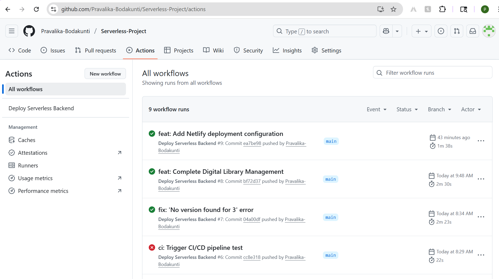
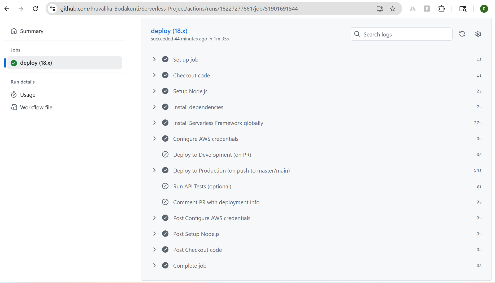
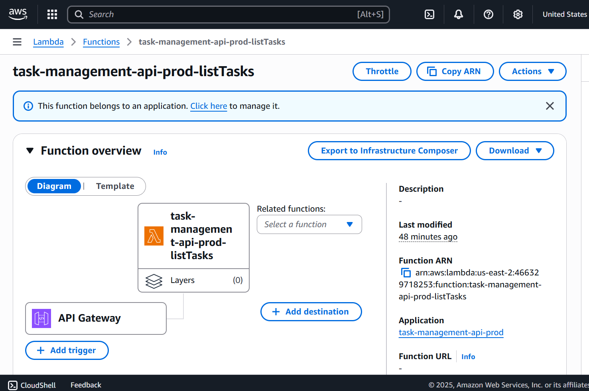
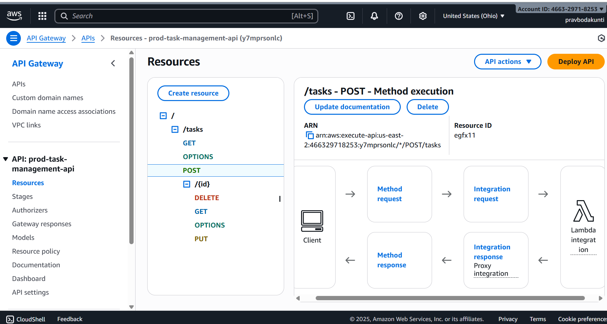
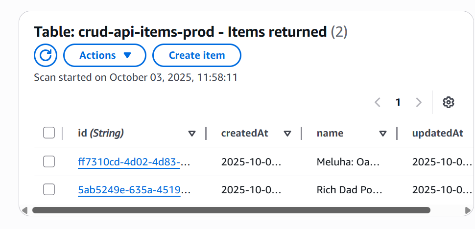
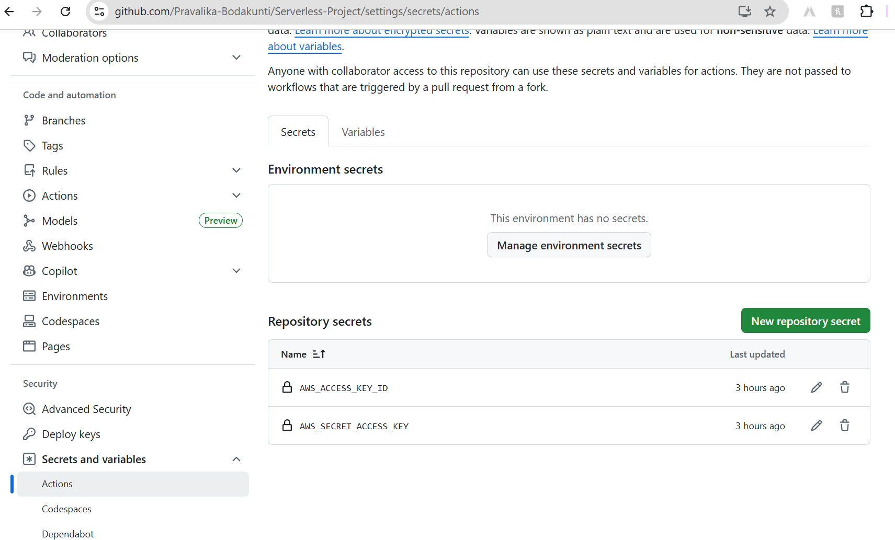

# Digital Library Management System

A modern, full-stack application for managing your digital book collection. Built with React frontend and AWS serverless backend, this system lets you easily organize, track, and manage your books with a clean, responsive interface.

## What This Project Does

This is a complete library management system that allows you to:
- **Add new books** to your digital collection
- **View all your books** in an organized table
- **Edit book details** when you need to update information
- **Remove books** from your collection


The system is built to be fast, reliable, and easy to use on any device - from your phone to your desktop computer.

##  How It's Built

### Frontend (What You See)
- **React** - Modern web framework for the user interface
- **Material-UI** - Beautiful, responsive design components
- **TypeScript** - Clean, type-safe code
- **Axios** - Handles communication with the backend

### Backend (The Engine)
- **AWS Lambda** - Serverless functions that handle your requests
- **DynamoDB** - Fast, reliable database for storing book information
- **API Gateway** - Secure endpoints for your frontend to connect to
- **Serverless Framework** - Manages all the AWS infrastructure automatically

## Getting Started

### Prerequisites
Before you start, make sure you have:
- Node.js (version 18 or higher)
- npm (comes with Node.js)
- AWS account with appropriate permissions
- Git

### Installation

1. **Clone the repository**
   ```bash
   git clone https://github.com/Pravalika-Bodakunti/Serverless-Project.git
   cd Serverless-Project
   ```

2. **Install backend dependencies**
   ```bash
   cd crud-api
   npm install
   ```

3. **Install frontend dependencies**
   ```bash
   cd ../frontend
   npm install
   ```

### Running the Application

1. **Start the frontend development server**
   ```bash
   cd frontend
   npm start
   ```
   This will open your browser to `http://localhost:3000`

2. **Deploy the backend to AWS**
   ```bash
   cd crud-api
   serverless deploy
   ```

##  Using the Application

### Adding a New Book
1. Click the "Add Book" button
2. Enter the book title
3. Click "Add Book" to save

### Viewing Your Library
- All your books are displayed in a clean table
- You can see when each book was added
- The table is responsive and works on mobile devices

### Editing a Book
1. Click the edit icon next to any book
2. Change the title
3. Click "Update Book" to save changes

### Removing a Book
1. Click the delete icon next to any book
2. Confirm the deletion

##  Configuration

### Backend Configuration
The backend is configured in `crud-api/serverless.yml`. Key settings:
- **Region**: us-east-2 (Ohio)
- **Runtime**: Node.js 18.x
- **Database**: DynamoDB with pay-per-request billing

### Frontend Configuration
Update the API URL in `frontend/src/services/api.ts`:
```typescript
const API_BASE_URL = 'https://your-api-gateway-url.amazonaws.com/prod';
```

##  Development

### Project Structure
```
├── crud-api/                 # Backend serverless functions
│   ├── functions/           # Lambda functions
│   ├── serverless.yml       # Infrastructure configuration
│   └── package.json         # Backend dependencies
├── frontend/                # React frontend
│   ├── src/
│   │   ├── components/      # React components
│   │   └── services/         # API communication
│   └── package.json         # Frontend dependencies
├── scripts/                 # Deployment scripts
└── .github/workflows/       # CI/CD pipeline
```

### Available Scripts

**Backend:**
- `npm run deploy` - Deploy to production
- `npm run deploy:dev` - Deploy to development
- `npm run remove` - Remove all AWS resources
- `npm run logs` - View function logs

**Frontend:**
- `npm start` - Start development server
- `npm run build` - Build for production
- `npm test` - Run tests

**Deployment Scripts:**
- `./scripts/deploy.sh [dev|prod]` - Deploy with custom script
- `./scripts/test-api.sh [dev|prod]` - Test API endpoints
- `./scripts/cleanup.sh [dev|prod]` - Clean up resources

##  CI/CD Pipeline

The project includes automated deployment through GitHub Actions:
- **Push to main branch** → Deploys to production
- **Pull request** → Deploys to development for testing
- **Automatic testing** → Runs tests before deployment

### GitHub Actions Workflow


### Build Logs


### AWS Resources Deployed




### GitHub Secrets Configuration

##  Testing

### Running Tests
```bash
# Backend tests
cd crud-api
npm test

# Frontend tests
cd frontend
npm test
```

### API Testing
```bash
# Test production API
./scripts/test-api.sh prod

# Test development API
./scripts/test-api.sh dev
```

## Monitoring and Logs

### Viewing Logs
```bash
cd crud-api
serverless logs -f createItem
serverless logs -f listItems
```

### CloudWatch
- Logs are automatically sent to AWS CloudWatch
- Monitor function performance and errors
- Set up alerts for production issues

## Security Features

- **CORS enabled** - Secure cross-origin requests
- **Input validation** - All inputs are validated before processing
- **Error handling** - Comprehensive error handling and logging
- **IAM permissions** - Least privilege access to AWS resources

##  Cost Management

This project is designed to be cost-effective:
- **DynamoDB** - Pay only for what you use
- **Lambda** - Pay per request, not per hour
- **API Gateway** - Free tier includes 1 million requests/month
- **No servers to maintain** - Serverless architecture

##  Troubleshooting

### Common Issues

**Frontend not connecting to backend:**
- Check the API URL in `frontend/src/services/api.ts`
- Verify the backend is deployed
- Check browser console for errors

**Backend deployment fails:**
- Ensure AWS credentials are configured
- Check the `serverless.yml` configuration
- Verify IAM permissions

**Database errors:**
- Check DynamoDB table exists
- Verify IAM permissions for DynamoDB
- Check function logs for specific errors

### Getting Help

1. Check the logs: `serverless logs -f functionName`
2. Verify AWS resources in the AWS Console
3. Test API endpoints manually
4. Check GitHub Actions for deployment issues

##  Deployment Options

### Manual Deployment
```bash
cd crud-api
serverless deploy --stage prod
```

### Automated Deployment
- Push to main branch triggers production deployment
- Pull requests trigger development deployment
- All deployments are logged in GitHub Actions

##  Performance

- **Fast response times** - Serverless functions start in milliseconds
- **Scalable** - Automatically handles traffic spikes
- **Efficient** - Only runs when needed, no idle costs
- **Reliable** - Built on AWS's proven infrastructure

##  Contributing

1. Fork the repository
2. Create a feature branch
3. Make your changes
4. Test thoroughly
5. Submit a pull request

##  License

This project is open source and available under the MIT License.

##  Acknowledgments

- Built with AWS Serverless technologies
- Frontend powered by React and Material-UI
- Infrastructure managed by Serverless Framework
- CI/CD powered by GitHub Actions

---
